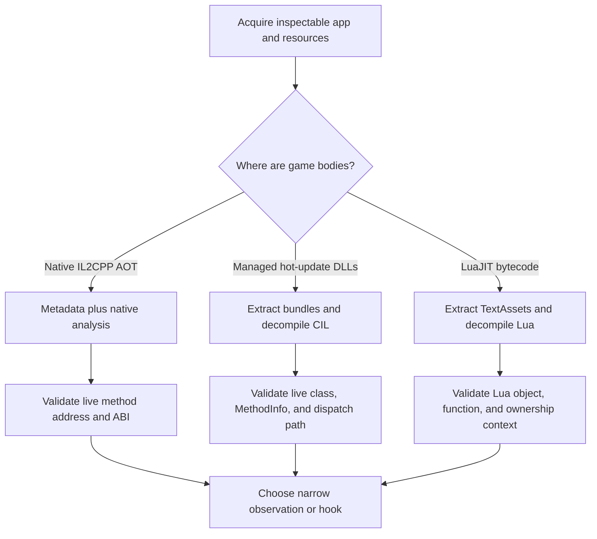

# Unity Game Decompiler Learning Journey

This document distills three reverse-engineering projects into one reusable
workflow for studying Unity games with different scripting architectures. It
is meant to preserve the reasoning process: how the architecture was
identified, how the real logic was recovered, which tools were useful, why
some outputs were misleading, and how static findings were validated against a
running process.

The three case studies are:

1. **Legend Summoner** — conventional Unity IL2CPP/AOT;
2. **WittleDefender / 胡鬧地牢** — Unity IL2CPP with HybridCLR hot-update
   assemblies; and
3. **Unity-LuaJIT game** — Unity IL2CPP host with gameplay scripts compiled as
   LuaJIT 2.1 bytecode.

The central lesson is simple:

> Identify where executable gameplay logic lives before choosing a decompiler
> or designing a hook.

These notes assume authorized research on software and accounts the researcher
is permitted to inspect. Client-side observations do not establish authority
over a remote service, and local behavior should not be confused with
server-accepted state.

## Why these three games require different workflows

All three applications use Unity and have an IL2CPP native host, but their game
logic is stored and executed differently.

| Case | Where useful metadata lives | Where real gameplay bodies live | Primary static tools | Runtime implication |
| --- | --- | --- | --- | --- |
| Conventional IL2CPP/AOT | `global-metadata.dat`, reconstructed dummy DLLs | Native ARM64 code in app/framework | Il2CppDumper/Cpp2IL, ILSpy, IDA/Ghidra | Native method address can be useful after ABI/signature validation |
| IL2CPP + HybridCLR | Live IL2CPP metadata and hot-update DLL metadata | Managed CIL in runtime-loaded `HotFix*.dll`, executed through HybridCLR | Unity bundle extractor, ILSpy, PE/.NET tools | `MethodInfo*` is useful; `virtualAddress` may be a shared thunk |
| Unity + LuaJIT | Lua asset names, constants, native Lua integration | LuaJIT bytecode inside `TextAsset`/AssetBundle resources | AssetStudio, hex viewer, LuaJIT decompiler | Hook Lua functions/state or Lua API only after identifying shared script logic |

The same `.app` can therefore require three separate questions:

```text
What is the Unity backend?
What scripting/runtime layers were added above it?
Where are the current game-rule bytes loaded from?
```

## Architecture-first decision tree



Do not start by searching for one favorite tool. Start by classifying the
artifact and execution model.

## Phase 0: preserve evidence before analysis

Before extracting or modifying anything, create a build-specific evidence set.
At minimum, preserve:

- original IPA or installed application copy;
- main executable and Unity framework;
- `global-metadata.dat`, if present;
- Addressables catalogs and relevant AssetBundles;
- recovered managed DLLs or Lua bytecode;
- tool names and versions;
- hashes of every important input and output;
- application version, build number, bundle identifier, architecture, and
  installation source; and
- runtime logs that demonstrate method resolution or hook hits.

Example inventory commands:

```bash
file Payload/Game.app/Game Payload/Game.app/Frameworks/UnityFramework.framework/UnityFramework
shasum -a 256 path/to/artifact
find Payload/Game.app -type f | sort > app-file-inventory.txt
```

Never mix artifacts from different builds. A metadata file from one release
and a native binary from another can produce plausible-looking but incorrect
addresses and layouts.

Recommended project layout:

```text
project/
├── originals/          # immutable source artifacts
├── hashes/             # checksums and version notes
├── extracted/          # bundle payloads and recovered DLL/bytecode
├── decompiled/         # exported C#, pseudocode, or Lua
├── runtime/            # Frida probes and captured diagnostics
├── hooks/              # validated instrumentation source
├── reports/            # design notes and result/network analysis
└── README.md            # current architecture and continuation point
```

## Phase 1: acquire an inspectable application

### Understand what “decrypted” means

The word “decrypted” can describe different layers and should always be
qualified.

| Layer | Meaning |
| --- | --- |
| iOS application executable | FairPlay-protected Mach-O has been made suitable for static inspection |
| Unity AssetBundle | Bundle container has been parsed/decompressed; this is not necessarily cryptographic decryption |
| Managed hot-update DLL | Embedded bytes have been recovered as a valid PE/CLI assembly |
| LuaJIT script | Bytecode has been decoded/decompiled into readable Lua-like source |

A decrypted IPA does not automatically expose readable game logic. It only
makes the packaged application and resources available for the next stage.

Likewise, recovering `Assembly-CSharp.dll` from an IL2CPP dump does not mean
the original managed bodies were recovered. It may be a metadata-only dummy
assembly.

### Inspect the package broadly

Useful first-pass searches include:

```bash
unzip -l Game.ipa | grep -Ei \
  'global-metadata|il2cpp|lua|script|hotfix|hybrid|dll|bundle|catalog'
```

After extraction:

```bash
find Payload/Game.app -type f \
  \( -iname '*.bundle' -o -iname '*.ab' -o -iname '*.bytes' \
     -o -iname '*.dll' -o -iname 'global-metadata.dat' \) -print
```

Also inspect native strings and loaded modules for clues such as:

```text
HybridCLR
il2cpp_runtime_invoke
lua_pcall
luaL_loadbuffer
LuaJIT
HotFix
Addressables
```

These strings are clues, not final proof. Confirm them with file formats,
metadata, call paths, and runtime behavior.

## Case study A: conventional Unity IL2CPP/AOT

### Representative project

The Legend Summoner project used:

- a decrypted native application image;
- `global-metadata.dat`;
- IL2CPP dump output such as `dump.cs`;
- reconstructed dummy assemblies such as `Assembly-CSharp.dll`;
- ILSpy for type/signature navigation;
- IDA/native disassembly for actual method bodies; and
- `frida-il2cpp-bridge` for live runtime resolution.

### What IL2CPP changed

Unity converted managed C# methods into native machine code ahead of time. A
dummy assembly reconstructed from metadata can restore:

- namespace and class names;
- fields and offsets;
- method names and signatures;
- tokens and attributes; and
- RVA/address annotations when the dumper can recover them.

It usually cannot restore the original C# implementation. ILSpy may show:

```csharp
private double CalcDamage(...)
{
    return default(double);
}
```

That is a dummy body. The real implementation is native ARM64 code in the
loaded executable or Unity framework.

### Decompilation workflow

1. Match the decrypted native image with its `global-metadata.dat`.
2. Run an IL2CPP reconstruction tool such as Il2CppDumper or Cpp2IL.
3. Load generated dummy assemblies into ILSpy or dnSpy for semantic browsing.
4. Use `dump.cs`/method metadata to identify the exact declaring class,
   signature, token, field layout, and RVA.
5. Rebase/correlate that RVA in IDA or Ghidra and study the real native body.
6. At runtime, resolve the method from the live IL2CPP domain rather than
   hard-coding an absolute address.
7. Verify executable memory, module ownership, instruction stream, signature,
   return type, instance/static form, and native ABI.
8. Attach a diagnostic hook first and prove it receives the expected objects
   and call frequency.

### Why live metadata resolution matters

A static RVA is not an absolute runtime pointer. ASLR changes module bases, and
updates can move methods. The Legend Summoner agent therefore resolved methods
like:

```text
LS.HitProcessSystem.CalcDamage(...)
LS.Battle.Models.Summoner.AddExp(System.UInt32)
```

through the live `Assembly-CSharp` image.

### Full signatures and ABI are mandatory

Never select a method by name alone. Validate:

- declaring assembly and class;
- instance versus static;
- exact parameter count and type names;
- return type;
- by-reference parameters;
- value-type versus reference-type passing; and
- platform ABI.

One subtle lesson involved `ProjectileDataComponent`, a value type. The bridge
reported boxed metadata offsets, while the native method received an unboxed
value. The native field offset had to exclude the two-pointer IL2CPP object
header:

```text
unboxed offset = boxed metadata offset - 2 * pointerSize
```

That correction allowed the exact `IsAlly` field to distinguish allied from
enemy projectiles. Without ownership filtering, a shared damage formula
affected both sides.

### Hook design appropriate to AOT IL2CPP

A unique, validated native method can be a good interception point. Preserve
the original logic and transform only one input or output:

```text
call original -> obtain calculated result -> apply narrow transform -> return
```

This avoids recreating unknown critical-hit, buff, scaling, and state logic.
Retain the `NativeCallback`, capture the original function before replacement,
and add hit counters and diagnostic state.

### Main failure modes

- treating a dump RVA as a fixed runtime pointer;
- believing dummy ILSpy bodies are real;
- matching by method name only;
- declaring the wrong `NativeFunction` ABI;
- confusing boxed and unboxed value-type offsets;
- modifying a shared damage method without determining camp/ownership; and
- assuming an executable address remains valid across game builds.

## Case study B: Unity IL2CPP with HybridCLR hot updates

### Representative project

WittleDefender/胡鬧地牢 used IL2CPP as its host while core game logic was
delivered in hot-update assemblies, especially:

```text
HotFix.dll
HotFixBattle.dll
```

The investigated package stored them in Addressables paths similar to:

```text
Data/Raw/aa/iOS/dll_assets_assets/_resources/dll/
    hotfix.dll.bytes_<hash>.bundle
    hotfixbattle.dll.bytes_<hash>.bundle
```

Downloaded Addressables content can override the packaged copy, so analysis
must identify which catalog and bundle the running build actually loads.

### Recovering the hot-update DLL

1. Search the IPA and installed application for `dll_assets`, `hotfix`,
   `.dll.bytes`, catalogs, and bundles.
2. Preserve and hash the complete bundle.
3. Parse/decompress the UnityFS/AssetBundle using AssetStudio or a compatible
   UnityFS extractor.
4. Export the raw `TextAsset`/byte payload rather than a text-converted view.
5. Locate the `MZ`/PE managed image in the extracted bytes.
6. Validate the result with `file`, a PE/.NET parser such as `dnfile`, and a
   cryptographic hash.
7. Open the DLL in ILSpy and export the decompiled project.
8. Correlate static types with assemblies loaded in the live IL2CPP domain.

Unlike an IL2CPP dummy DLL, the HybridCLR hot-update DLL retained real CIL
method bodies. ILSpy therefore exposed genuine control flow, including
`ChangeHp(long)`, attribute calculations, battle ending, result hashing,
replay-command serialization, and network request construction.

### Why HybridCLR changes hook strategy

HybridCLR can execute many managed methods through shared interpreter/native
stubs. Consequently, `method.virtualAddress` may be:

- null;
- non-executable;
- a generic/shared thunk;
- identical for unrelated methods; or
- executable but never entered in the expected per-method ABI path.

The WittleDefender investigation observed an intended hook receiving a `this`
object from an unrelated managed class. Other MethodInfo-filtered hooks
installed but reported zero target hits. These were strong demonstrations that
an executable virtual address was not unique method identity.

### Static-to-runtime workflow

1. Use ILSpy to locate the actual class, field, method, and caller/callee flow.
2. Record the exact managed signature and semantics, including signedness and
   units.
3. Resolve the assembly/class/method from live metadata.
4. Compare virtual addresses among several unrelated methods to detect sharing.
5. Print `MethodInfo*`, signature, declaring class, address, module, and memory
   protection.
6. Prefer read-only runtime diagnostics before mutation.
7. If desired behavior is represented by stable state, mutate that state once.
8. If normal managed behavior should be preserved, invoke the exact method via
   `il2cpp_runtime_invoke` rather than hooking its shared stub.
9. Pin only objects whose state must later be restored; otherwise rediscover
   objects each command.
10. Avoid intercepting `il2cpp_runtime_invoke` globally because it is broad,
    reentrant, and ABI-sensitive.

### State mutation proved more reliable than polling

Early experiments repeatedly scanned heroes and invoked `ChangeHp` every 60 or
500 ms. They produced freezes, high log volume, stale-object access violations,
and races with object lifecycle. That design was enforcement by polling, not a
true hook.

More stable approaches operated on authoritative state once:

- `InvincibleCount` contribution for timed invincibility;
- `AttributeMap` dictionary values for ATK, DEF, healing, and weapon charge;
- `Levels_table.extraReroll` for ordinary rerolls;
- `InGameAttr.ReRandomSkillNum` for Crusade rerolls; and
- `InGameAttr.AdReviveTimes` for revive availability.

The object path itself was recovered statically and confirmed dynamically:

```text
BattleMainUI
  -> _mechaSkillNode
     -> _myCamp
        -> _heroList
           -> EntityHero
              -> GetRoleAttr()
                 -> RoleAttributeGroup.AttributeMap
                    -> Dictionary<int,int>
```

### Inline obfuscated value types

`CurrentHp` and `InvincibleCount` were not plain scalar fields. Decompiled
`ObfuscatedLong` and `ObfuscatedInt` showed an encoded value and XOR key.
Correct handling required:

- metadata-defined inline struct fields, not guessed offsets;
- signed `Int32` key semantics;
- `Int64` arithmetic for HP;
- consistency checks against concurrent key changes;
- write verification; and
- contribution ownership rather than forcing a shared count to zero.

### HybridCLR failure modes

- interpreting an executable thunk as a unique method body;
- attaching to generic `Dictionary.set_Item` and capturing unrelated writes;
- using wrong capitalization such as `set_item` instead of `set_Item`;
- treating an `AttributeMap` field name as a class name;
- using `Int32` for a managed `Int64` parameter;
- invoking managed methods repeatedly to enforce a state;
- caching unpinned objects across battle destruction/recreation;
- intercepting the global runtime invocation function; and
- statically repacking an Addressables bundle without satisfying catalog,
  CRC/hash, signing, or active-download-source validation.

## Case study C: Unity with LuaJIT gameplay scripts

### Representative project

The LuaJIT project identified:

```text
Unity:   2022.3.62f2
Backend: IL2CPP on iOS
Script:  LuaJIT 2.1.0-beta3, 64-bit bytecode
```

Core logic was stored in:

```text
Payload/<App>/Data/Raw/ios/script/script.ab
```

### Extracting scripts from the bundle

The successful workflow used the Razviar/modded AssetStudio build on Windows:

1. load `script.ab`;
2. filter assets by `TextAsset`;
3. select all relevant assets;
4. export selected assets as **Raw**; and
5. preserve the resulting `*.lua.bytes` hierarchy.

Raw export matters. A converted text export may alter binary content or fail on
bytecode that is not UTF-8 source.

### Verify bytecode before choosing a decompiler

The observed header was:

```text
1B 4C 4A 02 08
```

Interpretation used in this project:

- `1B 4C 4A` — LuaJIT bytecode signature;
- `02` — LuaJIT bytecode version associated with the recovered 2.1 build; and
- `08` — observed 64-bit-related dump flags in this artifact.

Header interpretation should be confirmed against the actual LuaJIT version
and dumper format rather than generalized from one byte sequence. A mismatch
between bytecode version, endianness/flags, or decompiler expectations can
produce assertions or misleading output.

### Bulk decompilation

More than ten thousand script assets made manual processing impractical. The
project used `Dr-MTN/luajit-decompiler` recursively:

```bash
python3 main.py \
  --recursive /path/to/TextAsset \
  --dir_out /path/to/Lua_Source \
  --file-extension .bytes \
  --catch_asserts
```

Keep the original bytecode beside decompiled output. LuaJIT decompilation is a
reconstruction: variable names, expressions, control structure, and edge cases
may not exactly match original source. When logic matters, compare constants,
branching, and bytecode/disassembly rather than trusting one pretty rendering.

### Analysis workflow for shared Lua logic

The first memory modifications targeted damage behavior and crashed because a
function such as `updateBlood(dt, enemy)` was shared by player and enemy
objects. The important discovery was not merely the function name, but the
object context that distinguished the player.

Useful player-specific clues included:

```text
self._domeInvincibleCD
self._extraBlood
P._player
P._playerUnion
```

The recovered invincibility gate resembled:

```lua
if self._domeInvincibleCD and self._domeInvincibleCD > 0 then
    dt = 0
end
```

The general Lua lesson mirrors the IL2CPP ownership lesson: shared logic must
be filtered by the table/object/camp that owns the call. A function name alone
does not identify the player path.

### Choosing between script and native runtime hooks

Prefer the highest-level stable point available:

1. a Lua field or function unique to the intended object;
2. a Lua dispatcher/event that exposes both action and ownership;
3. the LuaJIT C API (`lua_pcall`, `lua_getfield`, etc.) for diagnostics when
   script-level access is unavailable; or
4. native IL2CPP host code only when the behavior truly resides outside Lua.

Global Lua API hooks are high-frequency and see unrelated scripts. They require
exact Lua state identification, stack discipline, recursion protection, and
aggressive filtering. They are usually discovery tools before they are good
mutation points.

### LuaJIT failure modes

- opening bytecode as if it were plain Lua source;
- using a Lua 5.x decompiler for LuaJIT bytecode;
- exporting a binary `TextAsset` in converted rather than raw form;
- treating decompiler output as exact original source;
- modifying a shared damage function without identifying player/enemy context;
- assuming a Lua table key corresponds to a stable native offset;
- hooking `lua_pcall` without filtering the relevant `lua_State*` and caller;
  and
- ignoring dynamically downloaded or replacement script bundles.

## Unified decompiler workflow

The following process works as a repeatable funnel across all three game
types.

### Step 1: identify the loaded build

Record application version, build number, bundle ID, binary UUID, architecture,
Unity version, installation source, and resource/catalog version. Hash all
source artifacts.

### Step 2: inventory code-bearing artifacts

Search the package and runtime for:

- native Mach-O images;
- `global-metadata.dat`;
- `Assembly-CSharp.dll` and other managed DLLs;
- `HotFix*.dll.bytes_*.bundle`;
- `script.ab`, Lua-related bundles, and `*.lua.bytes`;
- Addressables catalogs and cached/downloaded bundles; and
- native imports/exports referring to IL2CPP, HybridCLR, Mono, or Lua.

### Step 3: classify every artifact by format

Use magic bytes and parsers, not filenames alone:

```text
Mach-O      -> native disassembler
PE/CLI DLL  -> ILSpy/dnSpy/.NET metadata tools
UnityFS     -> AssetStudio/Unity bundle extractor
LuaJIT BC   -> matching LuaJIT bytecode decompiler/disassembler
JSON catalog-> inspect dependency and content-hash mapping
```

A file named `.bytes` can contain CIL, LuaJIT bytecode, encrypted data, or an
arbitrary serialized object. Detect the payload before renaming it.

### Step 4: recover the highest-level faithful representation

- For AOT IL2CPP, use dummy DLLs for symbols and native disassembly for bodies.
- For HybridCLR, extract the real managed DLL and decompile its CIL.
- For LuaJIT, export raw scripts and use a version-compatible bytecode
  decompiler.

Do not stop at a representation that omits the actual implementation.

### Step 5: reconstruct control flow, ownership, and data flow

For each candidate behavior, document:

```text
input/event
  -> calculation/gate
     -> authoritative state mutation
        -> UI/statistics/replay update
           -> network serialization, if any
```

Search both “Uses” and “Used By.” Identify:

- who creates the object;
- which side/camp owns it;
- who calls the function;
- whether the function is shared;
- which field is authoritative versus derived/display-only;
- how the value is reset or restored;
- whether object pooling changes identity; and
- whether results enter statistics, replay commands, hashes, or requests.

### Step 6: correlate static names with the running game

Static analysis proposes a model; runtime observation tests it. Print or record:

- loaded assembly/image names;
- full class and namespace;
- exact method signature and `MethodInfo*`;
- runtime virtual address and module;
- field type and metadata offset;
- live object class and handle;
- call/hit count;
- relevant arguments and return values; and
- lifecycle transitions across menus and battles.

For HybridCLR, explicitly compare candidate virtual addresses with unrelated
methods. For LuaJIT, correlate function/table identity with the correct
`lua_State*` and script module.

### Step 7: begin with diagnostic-only instrumentation

Before mutation:

- count calls;
- log only sampled or filtered events;
- validate player/enemy ownership;
- compare values with visible UI;
- inspect object lifetime; and
- prove that the candidate point is reached in the intended game mode.

An installed hook with zero hits is not success. A high-frequency hook that
logs everything can itself freeze the game and distort the observation.

### Step 8: choose the least invasive control point

Use this preference order:

| Priority | Strategy | Best fit |
| ---: | --- | --- |
| 1 | One-time authoritative field/property mutation | HybridCLR state, Lua object state, configuration values |
| 2 | Invoke an existing managed/script setter or method | Preserve normal validation and side effects |
| 3 | Transform one argument or return value at a unique hook | Conventional AOT IL2CPP/native code |
| 4 | Hook a narrow dispatcher with exact filtering | Shared event systems or Lua dispatch |
| 5 | Interpreter/runtime API instrumentation | Discovery when no higher-level point is reachable |
| 6 | Polling/continuous enforcement | Last resort only, with lifecycle and rate controls |

The “best” hook is not always the function closest to the visible effect. It
is the narrowest point whose identity, ownership, ABI, lifecycle, and rollback
can all be explained.

### Step 9: design restoration before enabling mutation

For every change, answer:

- Is the new value absolute, additive, or multiplicative?
- Does repeated invocation compound?
- Who else can update the same field?
- Can the original value be restored exactly?
- Must the object be pinned until restoration?
- What happens if the object is destroyed or pooled?
- Does detaching leave modified process state behind?
- Is process restart the only reliable rollback?

Contribution-based state is safer than forcing a shared value. For example,
adding one invincibility count and later subtracting exactly one preserves
legitimate game contributions.

### Step 10: trace the output boundary

Do not assume that a local field is invisible because its name is absent from a
request. Follow:

```text
runtime state
  -> battle statistics
  -> end-state object
  -> replay command stream
  -> result/hash
  -> protobuf/JSON request
  -> server response
```

Record which data is:

- only displayed locally;
- included in a local result hash;
- explicitly serialized;
- inferable from replay timing/actions; or
- authoritative only on the server.

### Step 11: keep policy outside mechanism

Instrumentation source should expose neutral capabilities. Project
configuration should decide which commands run automatically. This allows the
same agent to attach in read-only mode and avoids rebuilding code merely to
change startup values.

### Step 12: preserve the failed experiments

Record failed hooks with:

- exact target and signature;
- resolution output;
- address/module/protection;
- hit counts;
- observed wrong object/argument;
- crash or freeze signature;
- game state and mode; and
- conclusion about the invalid assumption.

A failed attempt is valuable when it eliminates an architectural model.

## Tool-selection matrix

| Question | Preferred tools |
| --- | --- |
| What files are packaged? | `unzip`, `find`, `file`, hashes, strings |
| Which Unity assets contain code? | AssetStudio, AssetRipper, UnityFS parser, Addressables catalogs |
| Is this a managed PE assembly? | `file`, ILSpy, dnSpy, `dnfile`, `ildasm`-style tools |
| Is this ordinary IL2CPP metadata? | Il2CppDumper, Cpp2IL, dummy DLLs, `dump.cs` |
| Where is an AOT method body? | IDA Pro, Ghidra, Hopper, LLDB |
| Is this LuaJIT bytecode? | hex viewer, header check, LuaJIT bytecode tools |
| Can bytecode be recovered in bulk? | recursive LuaJIT decompiler plus assertion/error log |
| What is loaded now? | Frida, `frida-il2cpp-bridge`, module and domain enumeration |
| Is a method address unique? | address comparison, module range, instruction inspection, hit counters |
| What reaches the server? | request-object tracing, schema decompilation, replay/result serialization analysis |

## Cross-case lessons

### File extension is not architecture

`.dll`, `.bytes`, `.bundle`, and `.ab` describe packaging conventions more
than execution semantics. Inspect magic bytes and loading code.

### Decompiled output has a confidence level

| Output | Typical confidence |
| --- | --- |
| Managed CIL decompiled from genuine hotfix DLL | High for control flow; names may still be transformed |
| IL2CPP dummy DLL | High for metadata/signatures; low or none for bodies |
| Native pseudocode | Useful but ABI/types may need correction |
| LuaJIT reconstructed Lua | Useful for logic/constants; not guaranteed original syntax |
| Runtime object/class/type report | High for current build and current state |

Mark facts, strong inferences, and unresolved hypotheses separately.

### Shared logic always requires ownership filtering

The same pattern appeared in different forms:

- Legend Summoner: shared damage calculation required `IsAlly`;
- WittleDefender: generic/shared HybridCLR entry points received unrelated
  methods or objects; and
- LuaJIT game: `updateBlood` served both player and enemies.

Before altering shared logic, find camp, owner, source entity, target entity,
table identity, or another reliable discriminator.

### Runtime address and managed identity are different concepts

For ordinary AOT IL2CPP, a method generally has a meaningful native body after
correct rebasing. For HybridCLR, many managed identities may share one native
dispatch address. For LuaJIT, the gameplay function may not have a stable
standalone native address at all.

### Polling is usually a symptom of an incomplete model

If the design repeatedly scans the heap and overwrites a value, look for:

- the authoritative backing field;
- the setter or reset path;
- a contribution counter;
- a configuration object;
- a state-transition function; or
- a higher-level dispatcher.

Polling can still be appropriate for discovery or monitoring, but it needs a
bounded interval, reentrancy guard, lifecycle validation, and minimal logging.

### “Works locally” and “accepted remotely” are different results

Progression, inventory, rewards, advertisements, and battle completion can be
server-authoritative. A local getter replacement may alter UI flow without
creating a valid transaction. A combat change may not appear as an explicit
field but can affect statistics, replay commands, completion time, or hashes.

## Validation checklist for any future game

### Artifact validation

- [ ] Application build and resource catalog versions recorded
- [ ] Native binary and metadata belong to the same build
- [ ] Important artifacts hashed
- [ ] File formats verified by magic/parser, not extension
- [ ] Downloaded/cached content checked for packaged-resource overrides

### Architecture validation

- [ ] Unity version identified
- [ ] Mono versus IL2CPP identified
- [ ] HybridCLR/other hot-update runtime checked
- [ ] Lua/LuaJIT/XLua/ToLua layer checked
- [ ] Real gameplay body location established

### Static-analysis validation

- [ ] Exact declaring type and full signature recorded
- [ ] Caller and callee paths traced
- [ ] Instance/static and value/reference semantics known
- [ ] Player/enemy ownership discriminator known
- [ ] Units, scaling, sign, and overflow behavior known
- [ ] Reset, pooling, and restore paths identified

### Runtime validation

- [ ] Loaded assembly/module/script identity confirmed
- [ ] Candidate address belongs to expected module
- [ ] Shared-address risk checked
- [ ] Native ABI or Lua stack contract validated
- [ ] Expected object types observed
- [ ] Diagnostic hit count greater than zero
- [ ] Logging rate bounded
- [ ] Behavior tested in every relevant battle mode

### Output-boundary validation

- [ ] Local statistics path inspected
- [ ] Replay/command recording inspected
- [ ] Result/hash construction inspected
- [ ] Request schema and send path inspected
- [ ] Response overwrite/rejection behavior inspected
- [ ] Claims limited to what client evidence can prove

## Updating after a game release

Treat every update as a new evidence set:

1. archive the old working inputs and hook diagnostics;
2. acquire and hash the new executable, metadata, catalogs, and code bundles;
3. rerun architecture detection instead of assuming the same runtime;
4. repeat extraction using the matching tool versions;
5. diff type names, method signatures, fields, enum values, attribute keys, and
   resource paths;
6. regenerate native symbols/dummy DLLs or decompiled hotfix/Lua trees;
7. rerun read-only resolution and hit-count probes;
8. confirm ownership filters and ABI/layout assumptions;
9. test neutral behavior before enabling transformations;
10. retest rollback and object lifecycle; and
11. recapture output/network boundaries for each supported mode.

Do not patch old addresses until they happen to work. Rebuild the evidence
chain.

## Suggested learning progression

These projects form a useful sequence:

### Stage 1: packaged data and file formats

Learn ZIP/IPA layout, Mach-O, PE/CLI, UnityFS, AssetBundles, TextAssets, hashes,
and magic-byte identification.

### Stage 2: managed metadata

Learn assemblies, namespaces, classes, fields, methods, signatures, generic
types, value types, backing fields, and call-graph navigation in ILSpy.

### Stage 3: IL2CPP translation

Learn how metadata maps to native code, why dummy DLLs lack bodies, ASLR/RVA
rebasing, and native ABI/value-type layout.

### Stage 4: alternative scripting runtimes

Learn HybridCLR dispatch and LuaJIT bytecode/runtime behavior. Compare managed
identity, interpreter identity, and native entry points.

### Stage 5: runtime evidence

Learn Frida object discovery, live metadata resolution, safe field reads,
method invocation, call counters, thread/lifecycle constraints, and structured
diagnostic output.

### Stage 6: systems thinking

Trace one behavior end to end—from input through state, simulation,
statistics, replay, serialization, and response. This is more transferable than
memorizing any one address or hook.

## Template for documenting the next game

Copy and complete this section for each new project:

```markdown
# <Game> Reverse-Engineering Record

## Build identity
- App version/build:
- Bundle ID:
- Architecture:
- Unity version:
- Artifact hashes:

## Execution architecture
- Backend: Mono / IL2CPP
- Hot update: none / HybridCLR / other
- Script VM: none / LuaJIT / Lua / other
- Evidence:

## Code-bearing artifacts
- Native image:
- Metadata:
- Managed DLLs:
- Script bundles:
- Downloaded overrides:

## Extraction workflow
- Source path:
- Container format:
- Extraction tool/version:
- Output validation:

## Decompilation workflow
- Tool/version:
- What output is authoritative:
- Known reconstruction limitations:

## Target behavior
- Input/event:
- Exact class/function/signature:
- Ownership filter:
- Authoritative state:
- Callers/callees:
- Reset/restore path:

## Runtime validation
- Loaded identity:
- MethodInfo/address/function identity:
- ABI/layout:
- Hit count:
- Expected objects:
- Neutral test:

## Output boundary
- Statistics:
- Replay/commands:
- Result/hash:
- Request/response:

## Failed hypotheses
- Attempt:
- Evidence:
- Conclusion:

## Current continuation point
- Proven:
- Inferred:
- Unknown:
- Next diagnostic:
```

## Handoff instructions for another AI

When continuing from this document, do not immediately generate a hook. First:

1. identify which of the three architecture branches fits the new target;
2. verify that all artifacts come from the same build;
3. locate the real executable body rather than relying on filenames or dummy
   output;
4. reconstruct the control/data/ownership path;
5. validate the proposed identity at runtime with read-only diagnostics;
6. explain lifecycle and rollback before mutation;
7. inspect local statistics, replay, hashes, and network serialization; and
8. record new evidence and failed assumptions in a build-specific handoff.

The reusable skill is not “finding a damage address.” It is building a chain of
evidence from packaged bytes to runtime behavior.

## Final comparison

| Question | Conventional IL2CPP | HybridCLR hotfix | Unity-LuaJIT |
| --- | --- | --- | --- |
| Can ILSpy show real gameplay bodies? | Usually no for dummy DLLs | Yes for recovered hotfix DLLs | No; use LuaJIT decompiler |
| Is native disassembly central? | Yes | Sometimes, mainly runtime/AOT boundaries | Mainly for VM integration |
| Is `MethodInfo*` meaningful? | Yes | Yes, often more meaningful than VA | Only for IL2CPP host methods |
| Is `virtualAddress` normally hookable? | Often, after validation | Frequently shared/unreliable | Not for Lua script functions |
| Best first runtime probe | Exact native method hit counter | Live metadata/object/MethodInfo report | Script/table or filtered Lua API trace |
| Typical safest change | Narrow input/output transformation | One-time authoritative state mutation | Object-specific Lua field/function change |
| Most important filter | Source/target/camp | Managed identity plus live object ownership | Lua table/object/state ownership |
| Primary decompiler limitation | Missing managed bodies | Dispatch differs from visible managed identity | Reconstructed source is approximate |

These differences should remain visible in all future design documents. They
are the reason one successful technique cannot be copied blindly from one
Unity game to another.
